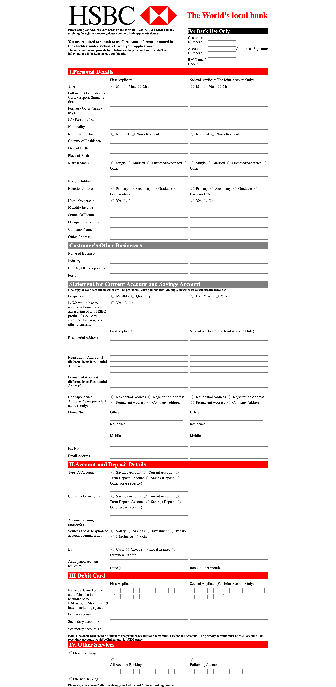

# Bank Form Demo

This project demonstrates a simple bank form interface, showcasing an example inspired by HSBC's form design. It highlights how banking forms can be structured using modern web technologies.

## Features
- Interactive input fields for user data.
- Clean and simple design using only HTML and CSS.

## Screenshot


## Technologies Used
- HTML5
- CSS3

## HSBC Credit
This demo includes design elements inspired by HSBC's form structure. All rights to HSBC's brand and design belong to HSBC Holdings plc. This project is for educational purposes only and is not affiliated with or endorsed by HSBC.

## How to Run
1. Clone the repository:
   ```bash
   git clone https://github.com/BhoomiGohil/Bank-Form-Demo.git
   ```
2. Open the `index.html` file in your browser.


